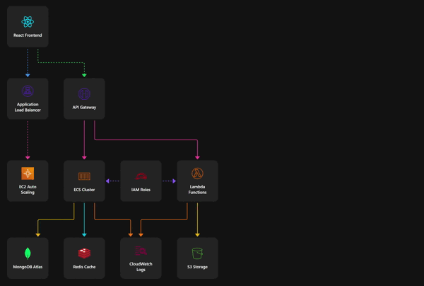

# React Flow Visualizer

[](https://opensource.org/licenses/MIT)
[](https://www.typescriptlang.org/)
[](https://reactjs.org/)
[](https://vitejs.dev/)
[](https://react-flow-visualizer.pages.dev/)

A powerful and flexible React application for creating interactive system architecture diagrams and workflow visualizations using React Flow. Built with React, TypeScript, and Vite.



## Quick Start

### Installation

```bash
# Clone the repository
git clone https://github.com/cherninlab/react-flow-visualizer.git

# Navigate to project directory
cd react-flow-visualizer

# Install dependencies
npm install

# Start development server
npm run dev
```

## Documentation

### API Reference

#### Node Types

```typescript
interface CustomSquareNodeData {
  label: string;
  iconName: string;
  iconType: 'lucide' | 'radix' | 'local';
  sourcePosition?: Position;
  targetPosition?: Position;
}
```

## Advanced Configuration

### Custom Theme Creation

1. Create a new CSS file in `src/themes/`:

```css
.react-flow[data-theme='your-theme'] {
  --icon-size: 48px;
  --margin: 16px;
  /* Add more variables */
}
```

2. Register in `ThemeSelector.tsx`:

```typescript
const themes = [
  { value: 'default', label: 'Default' },
  { value: 'your-theme', label: 'Your Theme' },
];
```

## Troubleshooting

### Common Issues

1. **Node Icons Not Loading**

   ```bash
   # Check if icons are in the correct directory
   public/icons/
   ```

## Contributing

We welcome contributions!

## License

This project is licensed under the MIT License

## Acknowledgments

- [React Flow](https://reactflow.dev/) for the core functionality
- [Monaco Editor](https://microsoft.github.io/monaco-editor/) for the code editing experience
